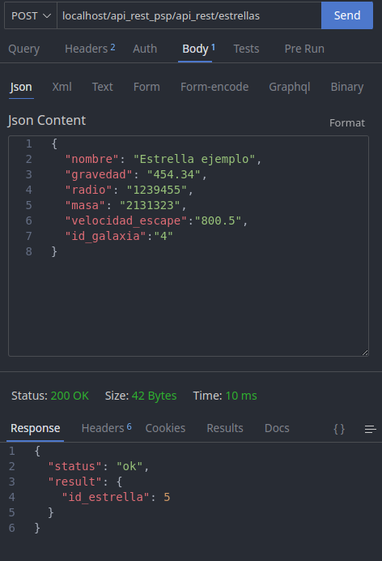

# API Rest PSP: operaciones CRUD
## Introducción
Esta API ha sido desarrollada en PHP, usando diferentes clases para cada tabla de la base de datos, conceptos de herencia de clases, y teniendo en cuenta los modificadores de acceso para optimizar el código. Cada clase tiene sus propios métodos para realizar las operaciones CRUD. Para la conexión con la base de datos se ha usado mysqli. Además, se ha implementado una clase adicional donde se gestionan los errores de respuesta de la API, junto a sus códigos de errores.

El tema de la API trata de elementos del universo, como planetas, estrellas, galaxias, etc. Cada elemento tiene sus propios atributos, como el nombre, la masa, la gravedad, etc. La API permite realizar las operaciones CRUD sobre cada tabla.
<i>Aclaración: la información que hay no es 100% real. Hay estrellas que no tienen galaxias, sino constelaciones</i>

## Instalación
Para poder usar la API, es necesario tener instalado un servidor web, (en mi caso Apache), y un servidor de base de datos (en mi caso MySQL). Además, es necesario tener instalado PHP en el servidor web. Una vez instalado todo, se debe crear una base de datos en el servidor de base de datos, y ejecutar el script de creación de tablas que se encuentra en la carpeta "sql" del proyecto. Por último, se debe modificar el archivo "config" con los datos de conexión a la base de datos si tienes otras credenciales.
## Uso
Para poder usar la API, es necesario tener instalado un cliente HTTP, como Postman, u otra herramienta de API's. Una vez instalado, se debe realizar una petición HTTP a la API, usando el método correspondiente a la operación que se quiera realizar. En mi caso he utilizado Thunder Client, una extensión de Visual Studio Code.

## Peticiones
Véase la documentación de la API para ver los métodos y parámetros de cada petición <strong>(index.html)</strong>.

## Ejemplos de peticiones a la API
### Obtención de todos los elementos de datos de una tabla
---


### Obtención de un elemento de datos de una tabla
---


### Obtención de todos los elementos de tres tablas
---


### Creación de un elemento de datos de una tabla
---



### Actualización de un elemento de datos de una tabla
---


### Eliminación de un elemento de datos de una tabla
---
<i>Aclaración: como mis tablas tienen una columna con claves ajenas, algunos registros no pueden ser eliminados por dependencia de clave ajena</i>


# ENTREGA 5.1 PSP
## Introducción
---
He implementado Google OAuth 2.0 para la autenticación y autorización de usuarios. Para ello, he creado una aplicación en la consola de desarrolladores de Google, y he configurado la API para que acepte peticiones de usuarios externos. El paquete de autenticación de Google OAuth 2.0 para PHP lo he implementado a través de Composer, ejecutando en la terminal del sistema dentro del directorio padre:

    ```
    composer require google/apiclient:"^2.0"
    ```

## Preguntas
---
### ¿Por qué es seguro el acceso a tu API REST usando autenticación y autorización?
---
Porque se utilizan tokens que garantizan la seguridad en el acceso. Cuando un usuario se autentifica, se genera un token que se utiliza para autorizar el acceso. Este token está cifrado y firmado digitalmente, por lo que solo el usuario que lo ha generado puede utilizarlo para acceder a la API.

### ¿Se utiliza algún tipo de cifrado de la información, cuál?
---
Sí, se utiliza el cifrado AES en modo CBC (Cipher Block Chaining). El token incluye información como la identidad del usuario, la fecha de expiración, etc.

### ¿De qué manera intervienen los sockets en la autenticación o en la autorización?
---
Los sockets se utilizan para la comunicación entre el cliente y el servidor. En este caso, la autenticación y autorización con Google OAuth se realiza mediante el intercambio de tokens cifrados entre el servidor de autenticación y la aplicación cliente (en este caso, la API). 

Aunque los sockets no intervienen directamente en el proceso de autenticación o autorización con Google OAuth, la tecnología de comunicación segura basada en HTTP y HTTPS garantiza que la información transmitida esté protegida.
